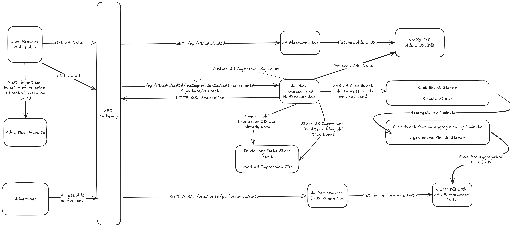

# Ad Click Aggregator

# Overview

Design Ad Click Aggregator System that will be used to display Ads on a website or an app. System should track Ads
performance based on ad clicks.

# Functional requirements

* User is redirected to an advertiser website after clicking on an Ad
* Advertiser can query Ads performance by checking click metrics
* Ads performance and click metrics have 1 minute granularity
* Protection against clicking an Ad multiple times that would skew Ad analytics, only first click on an Ad is recorded
  for a given user

## Out of scope

* Details Ad serving and placement in a website or an app
* Cross Device Tracking
* Conversion tracking
* Demographic profiling

# Non-functional requirements

* Traffic
  * 10 million Ads at any given time
  * 10k Ads clicks per second
* Availability - 99.9%
* Latency
  * Ad placement <300ms
  * Analytics Queries <1000ms
* Data consistency
  * strong
  * analytics as realtime as possible
* Client types - Browser, Mobile App

# APIs

* Get Ad data - `GET /api/v1/ads/:adId` that returns response body

```json
{
  "adId": "0191c1be-cb2d-7db6-94e9-dd600f72b3d5",
  "adImpressionId": "0191c354-ea64-73bb-ab10-e9423f97abe5",
  "adImpressionIdSignature": "yL8CeJw7wsvMwMVoseCgg2PmGjbG05ylDG",
  "adUrl": "http://ad-aggregator.com/api/v1/ads/0191c1be-cb2d-7db6-94e9-dd600f72b3d5/0191c354-ea64-73bb-ab10-e9423f97abe5/yL8CeJw7wsvMwMVoseCgg2PmGjbG05ylDG/redirect",
  "htmlCode": "..."
}
```

* Click on Ad and Get Redirection - `GET /api/v1/ads/:adId/:adImpressionId/:adImpressionIdSignature/redirect` that
  returns `HTTP 302 Found` with `Location`response header set to Ad url. Ad Performance data is increased only when
  adImpressionId was verified using adImpressionIdSignature and when adImpressionId was not used for this specific adId.

* Get Ad Performance Data - `GET /api/v1/ads/:adId/performance/data` that returns performance data in a format like:

```json
{
  "adId": "0191c1be-cb2d-7db6-94e9-dd600f72b3d5",
  "timeRange": {
    "start": "2024-09-05T17:45:00+02:00",
    "end": "2024-09-05T17:45:59+02:00"
  },
  "totalClicks": "385471"
}
```

# High Level Design



# Author

Dominik Cebula

* https://dominikcebula.com/
* https://blog.dominikcebula.com/
* https://www.udemy.com/user/dominik-cebula/
