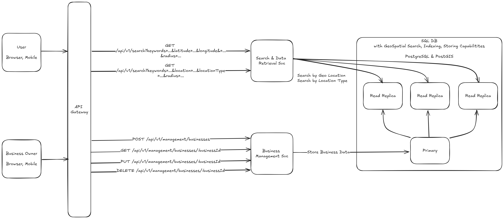

# Location Based Business Search Service

# Overview

Design Location Based Business Search Service like Yelp or Google Places.

# Functional requirements

* User can search for businesses based on keywords and selected location
    * Location can be:
        * a city
        * a city with radius
        * a city district
        * a city district with radius
        * current user location with radius
* User can see details on a selected business
* Business owners can add, update, delete a business
* Business changes made by business owners can appear in search results with a delay

# Non-functional requirements

* Traffic
    * 100 million daily active users
    * Average user makes 5 queries per day
    * Number of queries per day = $`5 * 100*10^6 = 500 million`$
    * Number of queries per second = $`500*10^6 / 86400 = 5787`$
* Storage
    * 200 million registered businesses
    * Number of bytes for single business registration
        * Max - $`4780B`$
        * Avg = $`693B`$
    * Number of bytes for business registrations (avg) = $`200*10^6 * 693 /1024/1024/1024 = 129GB`$
* Availability - 99.9%
* Latency <300ms
* Data consistency - eventual
* Client types - Browser, Mobile App

# Entity

* Business - max=4780, avg=693
    * ID - 16 bytes
    * Title - 100 bytes
    * Description - 2000 bytes
    * Phone Number - 16 bytes
    * E-Mail - 320 bytes
    * Website - 2048 bytes
    * Street Name - 85 bytes
    * BuildingNumber - 16 bytes
    * ApartmentNumber - 16 bytes
    * Zip Code - 10 bytes
    * State - 85 bytes
    * City ID - 4 bytes
    * City District ID - 4 bytes
    * Geolocation (latitude, longitude) - `geography(POINT, 4326)` - 32 bytes
    * Opening and Closing Hours - $`7 * 2 * 2 = 28 bytes`$
        * Monday
        * Tuesday
        * Wednesday
        * Thursday
        * Friday
        * Saturday
        * Sunday

* City - max=121, avg=46
    * ID - 4 bytes
    * Name - 85 bytes
    * Geolocation (latitude, longitude) - `geography(POINT, 4326)` - 32 bytes

* City District - max=125, avg=55
    * ID - 4 bytes
    * City ID - 4 bytes
    * Name - 85 bytes
    * Geolocation (latitude, longitude) - `geography(POINT, 4326)` - 32 bytes

# APIs

* Search for business
    * by geolocation - `GET /api/v1/search?keywords=...&latitude=...&longitude&=...&radius=...`
    * by named location - `GET /api/v1/search?keywords=...&location=...&locationType=...&radius=...`

responds with `200 OK` and response body:

```json
{
  "total": "10",
  "businesses": [
    {
      ...
    }
  ]
}
```

* Get Business Details for a user - `GET /api/v1/businesses/:businessId`

* Business Management operations for a business owner
    * Create - `POST /api/v1/management/businesses`
    * Read - `GET /api/v1/management/businesses/:businessId`
    * Update - `PUT /api/v1/management/businesses/:businessId`
    * Delete - `DELETE /api/v1/management/businesses/:businessId`

# High Level Design



# Author

Dominik Cebula

* https://dominikcebula.com/
* https://blog.dominikcebula.com/
* https://www.udemy.com/user/dominik-cebula/
