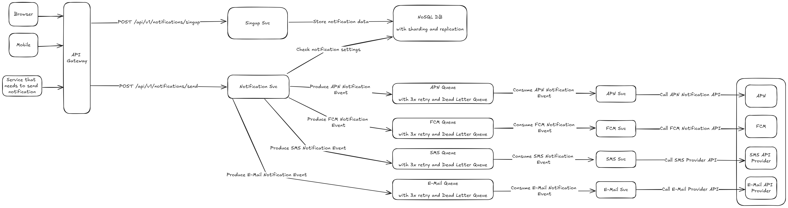

# Notification System

# Overview

Design a notification system that will support Mobile Push, E-Mail and SMS.

# Functional requirements

* User can sign up for notifications
* User can opt out from receiving notifications on a selected device
* Notification can be sent to a user
* Notifications can be sent via:
    * Mobile Push
        * Android
        * iOS
    * E-Mail
    * SMS
* User can have multiple devices
* User can have only a single e-mail
* User can have only a single phone number

# Non-functional requirements

* Traffic
    * 10 million mobile push notifications per day
    * 5 million e-mails per day
    * 1 million SMS per day
  * 10 million monthly active users

# APIs

* Signup for notifications - request `POST /api/v1/notifications/singup` with body:

```json
{
  "sms": {
    "phoneNumber": "123123123",
    "enabled": "true"
  },
  "email": {
    "emailAddress": "user@mail.com",
    "enabled": "true"
  },
  "mobile_push": [
    {
      "device_id": "483737234",
      "device_token": "SJ48S3FH496S3R",
      "enabled": "true"
    },
    {
      "device_id": "753673331",
      "device_token": "H5A2D4AE3342S",
      "enabled": "true"
    }
  ]
}
```

* Send notification - request `POST /api/v1/notifications/send` with body:

```json
{
  "to": {
    "user_id": "10050"
  },
  "notification": {
    "title": "Lorem ipsum dolor sit amet",
    "body": "Maecenas pulvinar, sem vel lobortis blandit, turpis dolor cursus est, id maximus libero enim non orci."
  }
}
```

# Entities

|                  user |              |
|----------------------:|--------------|
|               user_id | int          |
|      sms_phone_number | varchar(16)  |
|   sms_channel_enabled | boolean      |
|                 email | varchar(320) |
| email_channel_enabled | boolean      |

|       device |         |
|-------------:|---------|
|    device_id | int     |
|      user_id | int     |
| device_token | varchar |
|      enabled | boolean |

# High Level Design



# Deep dives

TBD

# Author

Dominik Cebula

* https://dominikcebula.com/
* https://blog.dominikcebula.com/
* https://www.udemy.com/user/dominik-cebula/
