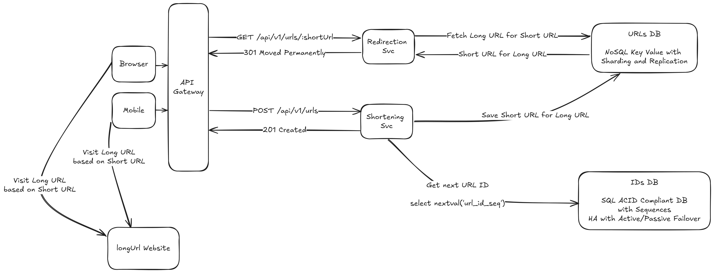

# URL Shortener

# Overview

Design URL Shortening Service that will redirect user to long URL based on given short URL.

# Core Use Cases

* Given a long url, service generates a short url for it
* Given a short url, service redirects a user to short url

Example:
Given URL https://www.amazon.com/Design-Patterns-Distilled-Dominik-Cebula-ebook/dp/B0C91X1GT8 service generates a short
url https://url.com/11PVWGSpX6

## Out of scope

* Short URLs management
* URL analytics
* AuthN and AuthZ

# Non-functional requirements

* Traffic
    * 100 million URLs generated each day
    * read-to-write ratio: 10:1
  * Write operations per second = $`100 * 10^6 / 86400 = 1157`$
  * Read operations per second = $`1157 * 10 = 11570`$
* Storage
    * Average DB Entry Size [B] = Avg Long Url + Avg Short Url + ID = $`83 + 10 + 8 = 101`$
    * DB Size After 1 Year [TB] = $`1 * 365 * 100*10^6 * 101 / 1024 / 1024 / 1024 / 1024 = 3.35`$
    * DB Size After 2 Year [TB] = $`2 * 365 * 100*10^6 * 101 / 1024 / 1024 / 1024 / 1024 = 6.7`$
    * DB Size After 5 Year [TB] = $`5 * 365 * 100*10^6 * 101 / 1024 / 1024 / 1024 / 1024 = 16.75`$
    * DB Size After 10 Year [TB] = $`10 * 365 * 100*10^6 * 101 / 1024 / 1024 / 1024 / 1024 = 33.5`$
* Availability - 99.9%
* Latency - <300ms
* Data consistency - strong
* Client types - Browser, Mobile

# APIs

* Redirect to long url based on short url
    * Request: `GET /api/v1/urls/:shortUrl`
    * Response:
        * `301 Moved Permanently` with `location` header - redirect user to long url based on short url
        * `404 Not Found` - when short url was not found
* Add new shortUrl based on longUrl
    * Request: `POST /api/v1/urls` with body
      `{ 'longUrl': 'https://www.amazon.com/Design-Patterns-Distilled-Dominik-Cebula-ebook/dp/B0C91X1GT8' }`
    * Response:
        * `201 Created` with `location` header containing value like `location: https://url.com/11PVWGSpX6` - when
          shortUrl for longUrl was created
        * `200 OK` with `location` header containing value like `location: https://url.com/11PVWGSpX6` - when
          shortUrl for longUrl did already exist

# Entities

|      URLs |               |
|----------:|---------------|
|        ID | bigint        |
|  LONG_URL | varchar(2048) |
| SHORT_URL | varchar(16)   |

# Microservices

* Redirection Svc
* Shortening Svc

# High Level Design

# Deep dives

## URL Shortening

URL will be shortened using Base 62 encoding and ID generated for given long url. If Short URL already exist for given
Long URL, already existing value will be used.

1. Check if Long URL already exists in URLs DB.
2. If yes, return `200 OK` with `location` header containing Short URL.
3. Generate unique ID for given URL, example: `12841`.
4. Base 62 encode `12841`, which will give `3idcElN`.
5. Save unique ID, given URL and Base 62 value in URLs table.
6. Return `201 Created` with `location` header containing Short URL.

## URL Redirection

1. Check if Short URL exists in URLs DB.
2. If yes, return `301 Moved Permanently` with `location` header set to Long URL.
3. If no, return `404 Not Found`.

## ID Generation

TBD

# Author

Dominik Cebula

* https://dominikcebula.com/
* https://blog.dominikcebula.com/
* https://www.udemy.com/user/dominik-cebula/
