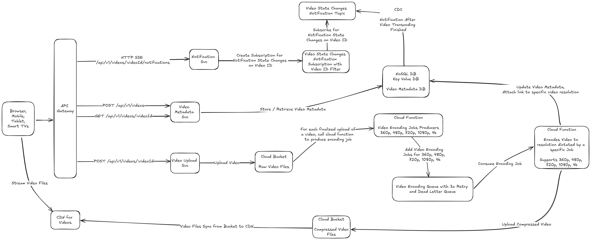

# Video Sharing Platform

# Overview

Design a video sharing platform like YouTube.

# Functional requirements

* Video upload
* Video playback
* Ability to change video quality playback
* Support for different resolutions
    * 360p
    * 480p
    * 720p
    * 1080p
    * 4k
* Support for different clients
    * Web Browser
    * Mobile
    * Tablets
    * Smart TVs
* Ability to upload videos of up to 1GB

# Non-functional requirements

* Traffic
    * Number of daily active users - 5 million
    * Average daily time spend on the product - 30 minutes
    * Average user watches 5 videos per day
    * 10% of users upload 1 video per day
    * Average video size - 300 MB
* Storage
    * DB
        * Number of videos uploaded each day - $`10\% * 5*10^6 = 500k`$
      * Average size of video metadata - $`100B + 500B = 600B`$
      * Metadata storage increase each day = $`500k * 600B /1024/1024 = 286 MB`$
      * Metadata storage increase each month = $`286MB * 30 /1024 = 8.37 GB`$
      * Metadata storage increase each year = $`8.37GB * 12 = 100 GB`$
      * Metadata storage required for 1st year = $`1 * 100GB = 100GB`$
      * Metadata storage required for 2nd year = $`2 * 100GB = 200GB`$
      * Metadata storage required for 3rd year = $`3 * 100GB = 300GB`$
      * Metadata storage required for 5th year = $`5 * 100GB = 500GB`$
      * Metadata storage required for 10th year = $`10 * 100GB = 1000GB`$
    * Media
        * Video storage increase each day - $`300MB * 10\% * 5*10^6 /1024/1024 = 143 TB`$
        * Video storage increase each month = $`143TB * 30 / 1024 = 4.18PB`$
        * Video storage increase each year = $`4.18PB * 12 = 50.16PB`$
        * Video storage required for 1st year = $`1 * 50.16PB = 50.16PB`$
        * Video storage required for 2nd year = $`2 * 50.16PB = 100.32PB`$
        * Video storage required for 3rd year = $`3 * 50.16PB = 150.48PB`$
        * Video storage required for 5th year = $`5 * 50.16PB = 250.8PB`$
        * Video storage required for 10th year = $`10 * 50.16PB = 501.6PB`$
* Availability - 99.9%
* Latency - <300ms
* Data consistency - eventual
* Client types - Browser, Mobile, Tablet, Smart TVs

# APIs

* Get Video by ID - `GET /api/v1/videos/:videoId` that produces response

```json
[
  {
    "title": "Top 10 Travel Destinations for 2024",
    "description": "Explore the top 10 must-visit travel destinations for 2024! From exotic beaches to historic cities, this list will inspire your next adventure.",
    "state": "DRAFT",
    "links": {
      "360p": "https://cdn.video-share.com/videos/0191bde4-1ef3-7eb4-add9-4c36e1dea811/360p",
      "480p": "https://cdn.video-share.com/videos/0191bde4-1ef3-7eb4-add9-4c36e1dea811/480p",
      "720p": "https://cdn.video-share.com/videos/0191bde4-1ef3-7eb4-add9-4c36e1dea811/720p",
      "1080p": "https://cdn.video-share.com/videos/0191bde4-1ef3-7eb4-add9-4c36e1dea811/1080p",
      "4k": "https://cdn.video-share.com/videos/0191bde4-1ef3-7eb4-add9-4c36e1dea811/4k"
    }
  },
  {
    "title": "How to Cook the Perfect Steak",
    "description": "Learn the secrets to cooking a restaurant-quality steak at home. This step-by-step guide covers everything you need to know to get that perfect sear and juicy flavor.",
    "state": "PUBLISHED",
    "links": {
      "360p": "https://cdn.video-share.com/videos/0191bde4-1ef3-744c-ae1f-9ce2c219ec75/360p",
      "480p": "https://cdn.video-share.com/videos/0191bde4-1ef3-744c-ae1f-9ce2c219ec75/480p",
      "720p": "https://cdn.video-share.com/videos/0191bde4-1ef3-744c-ae1f-9ce2c219ec75/720p",
      "1080p": "https://cdn.video-share.com/videos/0191bde4-1ef3-744c-ae1f-9ce2c219ec75/1080p",
      "4k": "https://cdn.video-share.com/videos/0191bde4-1ef3-744c-ae1f-9ce2c219ec75/4k"
    }
  },
  {
    "title": "The History of Space Exploration",
    "description": "Join us on a journey through time as we explore the history of space exploration, from the first moon landing to the latest missions to Mars.",
    "state": "READY_TO_BE_PUBLISHED",
    "links": {
      "360p": "https://cdn.video-share.com/videos/0191bde4-1ef3-7eae-a4ec-6fa4aa5e982c/360p",
      "480p": "https://cdn.video-share.com/videos/0191bde4-1ef3-7eae-a4ec-6fa4aa5e982c/480p",
      "720p": "https://cdn.video-share.com/videos/0191bde4-1ef3-7eae-a4ec-6fa4aa5e982c/720p",
      "1080p": "https://cdn.video-share.com/videos/0191bde4-1ef3-7eae-a4ec-6fa4aa5e982c/1080p",
      "4k": "https://cdn.video-share.com/videos/0191bde4-1ef3-7eae-a4ec-6fa4aa5e982c/4k"
    }
  }
]
```

* Add Video Metadata - `POST /api/v1/videos` with request body

```json
{
  "title": "How to Cook the Perfect Steak",
  "description": "Learn the secrets to cooking a restaurant-quality steak at home. This step-by-step guide covers everything you need to know to get that perfect sear and juicy flavor."
}
```

response will contain `location` header with `UUID` of Video ID in a format like
`/api/v1/videos/0821b7c0-a08b-7dd4-a4f2-e1a8cb0c6680`,
and `video_id` like `0821b7c0-a08b-7dd4-a4f2-e1a8cb0c6680`

* Upload Video
    * upload file chunks - `POST /api/v1/media/videos/0821b7c0-a08b-7dd4-a4f2-e1a8cb0c6680`
    * finalize upload - `POST /api/v1/media/images/0821b7c0-a08b-7dd4-a4f2-e1a8cb0c6680/finalize`

# High Level Design



# Author

Dominik Cebula

* https://dominikcebula.com/
* https://blog.dominikcebula.com/
* https://www.udemy.com/user/dominik-cebula/
